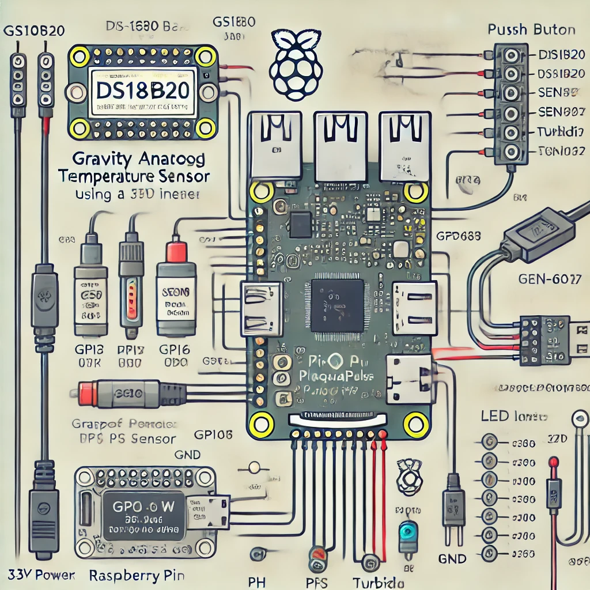

<div align="center">
<h1>🌊 PiAquaPulse 🌊</h1>
<p><strong>A Smart River Health Monitoring System</strong></p>
<p>
    
    
    
    
</p>

<!-- Add a project logo or banner image here -->
<p>[Project Logo/Banner Placeholder]</p>
</div>

## 📋 Table of Contents
- [Overview](#overview)
- [Key Features](#key-features)
- [Use Cases](#use-cases)
- [Hardware Requirements](#hardware-requirements)
- [Wiring Diagram](#wiring-diagram)
- [Software Setup](#software-setup)
- [Usage Instructions](#usage-instructions)
- [Future Improvements](#future-improvements)
- [Contributing](#contributing)
- [License](#license)

## 🔍 Overview
PiAquaPulse is a compact, battery-powered water quality monitoring system designed specifically for kayaking and outdoor water exploration. This device provides real-time data on water quality parameters, helping environmentalists, outdoor enthusiasts, and researchers collect valuable data during their trips.

The system efficiently logs water temperature, pH, turbidity, and GPS location, storing data offline with the capability to transmit it via Bluetooth when in range of a paired device.

## ✨ Key Features
- ✅ **Comprehensive Monitoring**: Logs water temperature, pH, turbidity, and GPS location
- ✅ **Energy Efficient**: Manual button-activated logging for extended battery life
- ✅ **User Feedback**: LED status indicator for operational feedback
- ✅ **Durable Design**: Waterproof and floating construction for harsh environments
- ✅ **Reliable Storage**: Offline data storage in CSV format for easy analysis
- ✅ **Compact Form Factor**: Designed to attach to kayaks or be carried during water expeditions

## 🚣‍♀️ Use Cases
- **Environmental Research**: Monitor water quality in remote or hard-to-reach locations
- **Citizen Science**: Enable kayakers and paddlers to contribute to water quality datasets
- **Educational Tool**: Teach students about water quality parameters through hands-on data collection
- **Personal Recreation**: Track water conditions during kayaking trips for personal records
- **Conservation Efforts**: Support water conservation initiatives with reliable data collection

## 🔧 Hardware Requirements

| Component | Description | Purpose |
|-----------|-------------|---------|
| Raspberry Pi Zero W/2W | Small single-board computer | Main processing unit |
| DS18B20 | Waterproof temperature sensor | Water temperature measurement |
| Gravity Analog pH Sensor | pH measurement probe | Measures water acidity/alkalinity |
| SEN0189 | Turbidity sensor | Measures water clarity |
| NEO-6M | GPS module | Location tracking |
| MCP3008 | Analog-to-digital converter | For analog sensors integration |
| Push Button | Waterproof tactile button | Manual logging activation |
| LED | Status indicator light | Visual feedback |
| Waterproof Case & Connectors | Environmental protection | Ensures system durability |

For detailed setup instructions and parts list, see [SETUP.md](SETUP.md).

## 📊 Wiring Diagram


A comprehensive wiring diagram showing all connections between the Raspberry Pi and sensors will be available soon. For now, please refer to the pin configuration in the `CONFIG` section of PAPScript.py and the detailed instructions in [SETUP.md](SETUP.md).

Raspberry Pi Zero W
├── DS18B20 Temperature Sensor
│   ├── Data → GPIO4
│   ├── Power → 3.3V
│   └── GND → GND
│
├── Gravity Analog pH Sensor (via MCP3008 ADC)
│   ├── Signal → MCP3008 CH0
│   ├── VCC → 3.3V
│   ├── GND → GND
│
├── SEN0189 Turbidity Sensor (via MCP3008 ADC)
│   ├── Signal → MCP3008 CH1
│   ├── VCC → 5V
│   ├── GND → GND
│
├── NEO-6M GPS Module (UART)
│   ├── TX → GPIO15 (RX)
│   ├── RX → GPIO14 (TX)
│   ├── VCC → 3.3V
│   ├── GND → GND
│
├── Push Button (Manual Logging)
│   ├── One Leg → GPIO17
│   └── Other Leg → GND (Pull-up resistor used)
│
├── LED Indicator (Status Feedback)
│   ├── Anode (+) → GPIO27
│   └── Cathode (-) → GND
│
├── MCP3008 (SPI Analog-to-Digital Converter)
│   ├── CH0 → pH Sensor Signal
│   ├── CH1 → Turbidity Sensor Signal
│   ├── VDD → 3.3V
│   ├── VREF → 3.3V
│   ├── AGND → GND
│   ├── CLK → GPIO11 (SPI SCLK)
│   ├── DOUT → GPIO9 (SPI MISO)
│   ├── DIN → GPIO10 (SPI MOSI)
│   └── CS → GPIO8 (SPI CE0)
│
└── Power Supply
    ├── USB Power Bank → Raspberry Pi Zero (Micro-USB Power Port)
    └── Optional: Voltage Step-down if using external battery pack


## 💻 Software Setup

### 1. Install Required Packages
On your Raspberry Pi, install dependencies:

```bash
sudo apt update && sudo apt install -y python3 python3-pip git
pip3 install RPi.GPIO serial
```

### 2. Clone the Repository
```bash
git clone https://github.com/aaronjacobs-chelt/PiAquaPulse.git
cd PiAquaPulse
```

### 3. Install Python Requirements
```bash
pip3 install -r requirements.txt
```

### 4. Run the Script
```bash
python3 PAPScript.py
```

For more detailed setup instructions, including hardware connections and configurations, please refer to the [SETUP.md](SETUP.md) file.

## 🚀 Usage Instructions

1. **Start Logging**: Press the button to initiate a data logging session. The LED will light up to confirm activation.
2. **Data Collection**: Once activated, the system will take readings from all sensors (temperature, pH, turbidity) and record the GPS location.
3. **Data Storage**: All collected data is automatically saved to `river_data.csv` on the Pi in an easy-to-analyze format.
4. **Continuous Monitoring**: The system can be configured for continuous monitoring or manual activation based on your needs.

## 🚧 Future Improvements

- **Wireless Connectivity**: Implement Bluetooth data transmission to companion mobile app
- **Power Efficiency**: Further battery optimization for extended field operations
- **Enhanced Analytics**: Add more advanced water quality metrics and analysis
- **Web Dashboard**: Develop a web interface for data visualization
- **Alert System**: Implement threshold-based alerts for critical water quality changes

## 👥 Contributing

Contributions to the PiAquaPulse project are welcome! Here's how you can contribute:

1. Fork the repository
2. Create your feature branch (`git checkout -b feature/amazing-feature`)
3. Commit your changes (`git commit -m 'Add some amazing feature'`)
4. Push to the branch (`git push origin feature/amazing-feature`)
5. Open a Pull Request

Please make sure to update tests and documentation as appropriate.

## 📄 License

This project is licensed under the MIT License - see the LICENSE file for details.
